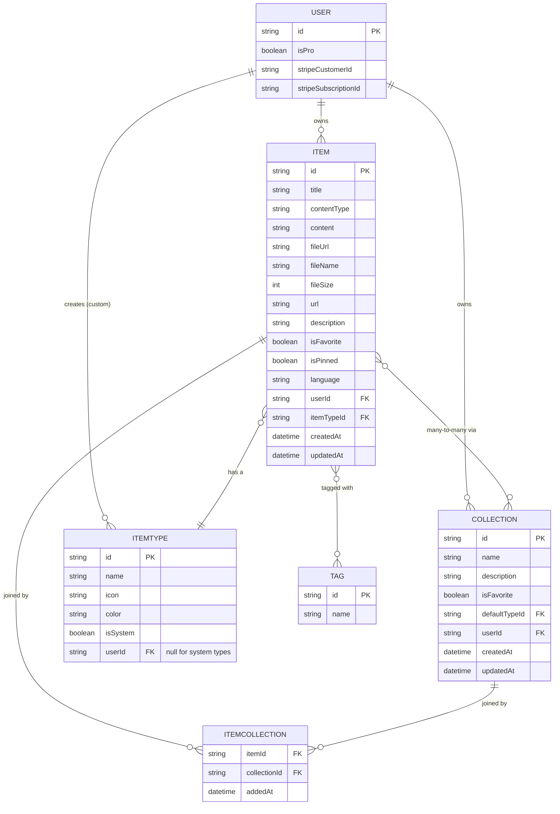
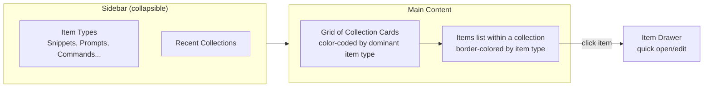

# DevStash — Project Overview

> One fast, searchable, AI-enhanced hub for all your dev knowledge & resources.

---

## 1. Problem

Developers keep their essentials scattered across too many tools:

| Where it lives today | What's lost there |
|---|---|
| VS Code / Notion | Code snippets |
| Chat history | AI prompts |
| Random project folders | Context files |
| Browser bookmarks | Useful links |
| Scattered docs folders | Documentation |
| `.txt` files | Commands |
| GitHub Gists | Project templates |
| Bash history | Terminal commands |

The result: constant context-switching, lost knowledge, and inconsistent workflows.

**DevStash's answer:** one place to capture, tag, search, and reuse all of it — enhanced with AI.

---

## 2. Target Users

| Persona | Core need |
|---|---|
| **Everyday Developer** | Fast capture/retrieval of snippets, prompts, commands, links |
| **AI-first Developer** | A home for prompts, contexts, and system messages |
| **Content Creator / Educator** | Store code blocks, explanations, course notes |
| **Full-stack Builder** | Collect reusable patterns, boilerplates, API examples |

---

## 3. Core Features

### A. Items & Item Types

Every piece of saved knowledge is an **Item**. Items have a **type**, which controls their icon, color, and content shape.

**System types (fixed, cannot be edited/deleted by users):**

| Type | Content shape | Color | Icon (lucide-react) |
|---|---|---|---|
| Snippet | text | `#3b82f6` blue | `Code` |
| Prompt | text | `#8b5cf6` purple | `Sparkles` |
| Note | text | `#fde047` yellow | `StickyNote` |
| Command | text | `#f97316` orange | `Terminal` |
| Link | url | `#10b981` emerald | `Link` |
| File *(Pro)* | file | `#6b7280` gray | `File` |
| Image *(Pro)* | file | `#ec4899` pink | `Image` |

Users can eventually create **custom types** (Pro, later phase) — system types remain immutable.

Each type maps to one of three underlying **content kinds**: `text`, `url`, or `file`.

Items are designed to be created and opened quickly via a **drawer** UI, not a full page navigation.

### B. Collections

- A Collection groups items of **any type** (a "React Patterns" collection could hold snippets *and* notes).
- Items support a **many-to-many** relationship with collections — e.g. a React snippet can live in both "React Patterns" and "Interview Prep".
- Examples: `React Patterns`, `Context Files`, `Python Snippets`.

### C. Search

Full search across:
- Content
- Tags
- Titles
- Types

### D. Authentication

- Email/password
- GitHub OAuth
- Powered by **NextAuth v5**

### E. Utility Features

- Favorite items & collections
- Pin items to top
- "Recently used" list
- Import code from a file
- Markdown editor for text-based types
- File upload for file/image types
- Export data (multiple formats)
- Dark mode (default), light mode optional
- Add/remove an item across multiple collections
- View which collections an item belongs to

### F. AI Features (Pro only)

Powered by **OpenAI `gpt-5-nano`**:

- Auto-tag suggestions
- AI summaries
- "Explain this code"
- Prompt optimizer

---

## 4. Data Model

### Entity Relationship Diagram



### Prisma Schema (draft)

> Rough draft — not final. Adjust cascade rules, indexes, and constraints as the schema stabilizes. Remember: **never use `db push`** — all schema changes go through migrations, run in dev, then promoted to prod.

```prisma
// schema.prisma
// Datasource: Neon (PostgreSQL) — Prisma 7

generator client {
  provider = "prisma-client-js"
}

datasource db {
  provider = "postgresql"
  url      = env("DATABASE_URL")
}

enum ContentType {
  TEXT
  URL
  FILE
}

model User {
  id                   String   @id @default(cuid())
  email                String   @unique
  name                 String?
  image                String?

  isPro                Boolean  @default(false)
  stripeCustomerId     String?  @unique
  stripeSubscriptionId String?  @unique

  items                Item[]
  collections          Collection[]
  itemTypes            ItemType[]   // custom types only

  createdAt            DateTime @default(now())
  updatedAt            DateTime @updatedAt

  // ...NextAuth required relations (Account, Session)
}

model ItemType {
  id       String  @id @default(cuid())
  name     String
  icon     String
  color    String
  isSystem Boolean @default(false)

  userId   String?           // null for system types
  user     User?   @relation(fields: [userId], references: [id], onDelete: Cascade)

  items    Item[]

  @@unique([userId, name])
}

model Item {
  id            String      @id @default(cuid())
  title         String
  description   String?

  contentType   ContentType
  content       String?     // text content (snippet/prompt/note/command)
  url           String?     // for link type
  fileUrl       String?     // R2 URL for file/image
  fileName      String?
  fileSize      Int?

  language      String?     // optional, for syntax highlighting

  isFavorite    Boolean     @default(false)
  isPinned      Boolean     @default(false)

  userId        String
  user          User        @relation(fields: [userId], references: [id], onDelete: Cascade)

  itemTypeId    String
  itemType      ItemType    @relation(fields: [itemTypeId], references: [id])

  collections   ItemCollection[]
  tags          Tag[]       @relation("ItemTags")

  createdAt     DateTime    @default(now())
  updatedAt     DateTime    @updatedAt

  @@index([userId])
  @@index([itemTypeId])
}

model Collection {
  id            String   @id @default(cuid())
  name          String
  description   String?
  isFavorite    Boolean  @default(false)

  defaultTypeId String?  // ItemType id used when creating new items in this collection

  userId        String
  user          User     @relation(fields: [userId], references: [id], onDelete: Cascade)

  items         ItemCollection[]

  createdAt     DateTime @default(now())
  updatedAt     DateTime @updatedAt

  @@index([userId])
}

model ItemCollection {
  itemId       String
  collectionId String
  addedAt      DateTime   @default(now())

  item         Item       @relation(fields: [itemId], references: [id], onDelete: Cascade)
  collection   Collection @relation(fields: [collectionId], references: [id], onDelete: Cascade)

  @@id([itemId, collectionId])
  @@index([collectionId])
}

model Tag {
  id    String @id @default(cuid())
  name  String @unique
  items Item[] @relation("ItemTags")
}
```

**Open questions to resolve before finalizing the schema:**
- Should `Tag` be per-user or global (currently drafted as global/unique across all users — likely needs a `userId` scope)?
- Does `Item.contentType` duplicate info already implied by `ItemType`? Consider deriving it instead of storing both.
- File size limits and validation for free vs. Pro tiers.

---

## 5. Tech Stack

| Layer | Choice |
|---|---|
| Framework | Next.js 16 / React 19 (SSR pages, dynamic components) |
| Backend | Next.js API routes (items, file uploads, AI calls) |
| Language | TypeScript |
| Database | Neon (PostgreSQL) |
| ORM | Prisma 7 (latest — verify docs before implementation) |
| Caching | Redis (maybe — evaluate need before adding) |
| File Storage | Cloudflare R2 |
| Auth | NextAuth v5 (email/password + GitHub OAuth) |
| AI | OpenAI `gpt-5-nano` |
| Styling | Tailwind CSS v4 + shadcn/ui |

**Repo structure:** single codebase / monorepo-free — one Next.js app for frontend + API to minimize overhead.

> ⚠️ **Migration policy:** never run `prisma db push` or edit the DB schema directly. All changes go through Prisma Migrate — apply in dev first, then promote the same migration to prod.

---

## 6. Monetization

Freemium model:

### Free
- 50 items total
- 3 collections
- All system types **except** file/image
- Basic search
- No file/image uploads
- No AI features

### Pro — $8/mo or $72/yr
- Unlimited items
- Unlimited collections
- File & image uploads
- Custom types *(later phase)*
- AI auto-tagging
- AI code explanation
- AI prompt optimizer
- Data export (JSON/ZIP)
- Priority support

> **Dev-mode note:** build the Pro/free gating foundation now (`isPro`, Stripe fields, feature checks), but leave all features unlocked for all users during development.

---

## 7. UI / UX

### Visual Direction
- Modern, minimal, developer-focused
- Dark mode by default; light mode optional
- Clean typography, generous whitespace
- Subtle borders and shadows
- Inspiration: **Notion**, **Linear**, **Raycast**
- Syntax highlighting on all code blocks

### Layout



- **Sidebar:** item type shortcuts + jump links, list of latest collections. Becomes a drawer on mobile.
- **Main:** grid of collection cards, background-tinted by the type that dominates each collection's contents.
- **Items:** displayed within their collection as color-bordered cards matching their type.
- **Item detail:** opens in a fast, lightweight drawer rather than a full page.

### Responsive
- Desktop-first, mobile-usable
- Sidebar collapses into a drawer on small screens

### Micro-interactions
- Smooth transitions
- Hover states on cards
- Toast notifications for actions (save, delete, favorite, etc.)
- Loading skeletons while data fetches

---

## 8. Open Questions / Follow-ups

- [ ] Scope `Tag` model per-user vs. global
- [ ] Finalize whether `contentType` lives on `Item` or is derived from `ItemType`
- [ ] Confirm Redis is actually needed before adding it to the stack
- [ ] Define custom type limits/rules for Pro (icon picker? color picker? validation?)
- [ ] Decide export formats precisely (JSON, ZIP — anything else, e.g. Markdown bundle?)
- [ ] Define R2 upload flow (direct client upload vs. proxied through API route) and per-tier file size caps
